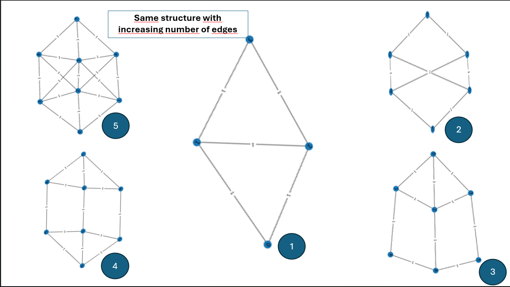
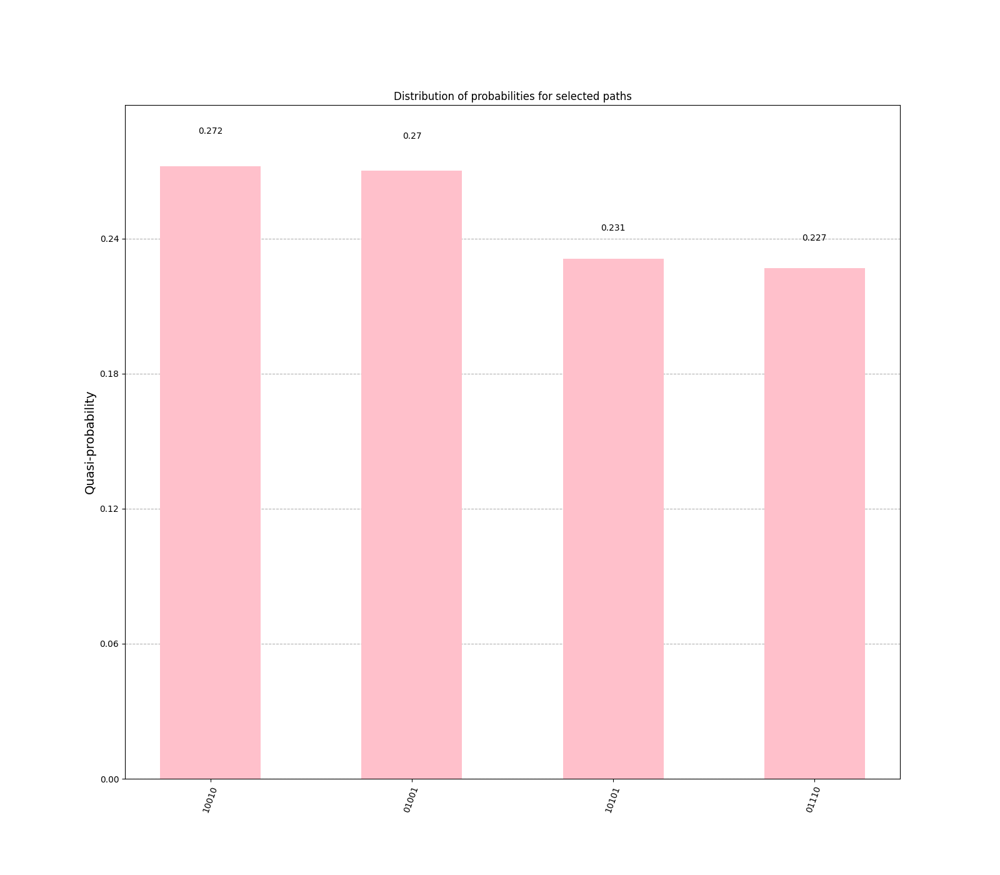
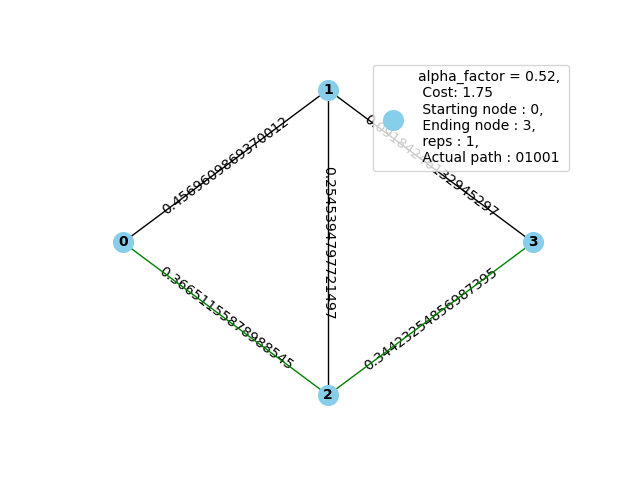
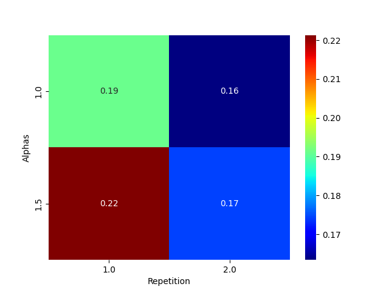
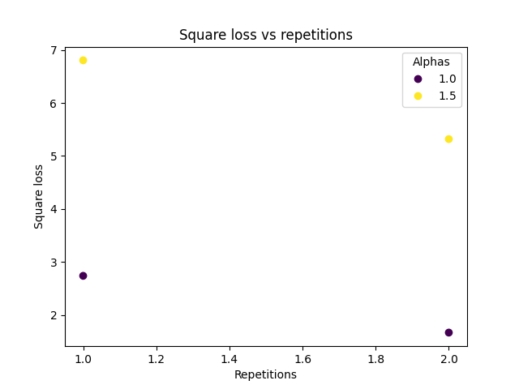
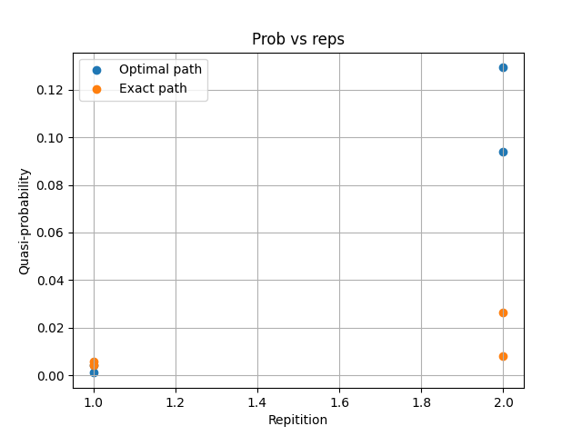

Quactography demo: From adjacency matrix to Hamiltonian and optimal path found with QAOA
==========================================================================================

Motivation and general picture of this project : 

This project can be seen in two different research areas. First, the mapping from diffusion data
with white matter masks and fiber orientation distribution functions peaks to a graph (found in data 
folder simplePhantoms or fodf.nii.gz and wm.nii.gz). Future works are left to do in this area to find 
a best suited mapping between diffusion-MRI data to graph, how to filter the graph without loss of information and 
more. Then, as a second and mainly developped aspect in this project is the quantum mapping of the 
optimisation problem at hand, which is : from any adjacency matrix which represents a connected graph, 
find the path that maximizes the weights from start node to end nodewithout going through an intermediate 
node more than once (maximum simple path). /

In order to do this, due to the limitation of graph size or 
number of qubits with which a local quantum algorithm can work with (which is our case with a local 
quantum Algorithm called QAOA using Qiskit library and local simulation of quantum computer), we must 
find a way to extract from diffusion data, regions where quantum algorithm could be useful, where local 
tracking leads to potential false tracks; this code has yet to be implemented. /

For now, we have in 
the data/test_graphs folder, graphs that were manually built which are the simplest 
representations of the crossing fibers regions; where a global tracking approach is of interest. With these 
toy graphs, we can test multiple scripts which leads to the the optimal path found by a quantum algorithm for a 
given graph with a defined start and end node. Furthurmore, to get more information about the solutions 
found by QAOA (the Quatum Approximate Optimization Algorithm), there are scripts to plot the path, plot 
the distribution of probabilities of solutions found, a histogram of the 10% most probable paths and 
the cost landscape for the given graph if we require only one layer (reps) of QAOA gates in the 
quantum circuit that is built with the quantum cost function to minimize (called Hamiltonian). 

Terminology
---------------

Operators: Quantum gate which has a matrix representation in our case, that can be applied to a ket (a vector in our case).
Thus, when applied to a vector in its basis (eigenvector), returns an eigenvalue which has a physical interpretation (or mapped to a physical system 
such as spin etc.) 

Hamiltonian : Quantum formulation of a classical cost function to optimize, we go from boolean variables and functions to operators which 
are represented by matrices, also called quantum gates. A sum of operators that, when applied to a vector (path in graph), returns a scalar 
representing the cost of the given path (eigenvalue of the operator).     

Mixer Hamiltonian : The Hamiltonian which is easy to find the state that minimizes the energy, used as starting point in QAOA circuit. 
We start in this Hamiltonian to evolve slowly towards the Hamiltonian which represents our real cost function. 

Driver Hamiltonian : Quantum formulation of the cost function of our problem, we end up in this Hamiltonian's ground state if
QAOA circuit functions as expected, and the evolution is under right conditions. 

Adiabatic Evolution : Physics Theorem which says that if we start in the ground state (lowest energy state of system),
and evolve the system gradually (slowly enough) to another system, we end up in the ground state of the new system. This
is done by a homotopy where at time t=0 we start in a simple well-known state where we know the state that minimizes the energy (cost function)
then at time t=1, we finish in a new system (represented by the quantum cost function of our problem which is not well known)
and we should end up in the ground state of this new system (minimum found through adiabatic evolution). 
Best known homotopy: (1-t) H_mixer + t H_driver. 

Qubit : Two-level system either 0 or 1 which corresponds to wether a path is absent (0) 
or present (1) in path. Represented by a vector (also called ket in quantum formalism). 

Pauli gates : Any cost function can be mapped to a Hamiltonian by a set of universal quantum gates, 

Pauli string : Qiskit library can do operations with quantum gates (operators)

Optimal Parameters : QAOA works as a parametrized circuit, and for each layer of gates (Mixer and Driver Hamiltonian), 
it takes in a set of parameters (gamma and beta). The optimal parameters are the gamma's and beta's whith gamma from 0 to 2pi 
and beta from 0 to pi, which minimizes the cost measured by quantum circuit with the highest probability. 

QUBO Quadratic Unconstrained Binary Optimization formulation : A way of expressing a cost function with constraints as 
a cost function without constraints, but penalties that represent the constraints. This requires a coefficient determined 
by us in order to add a weight and control how much breaking a constraint raises our cost, the more the coefficient is high, 
the more breaking the associated constraint is costly. 

Adjacency matrix : Matrix with nodes indices as rows and columns, and elements of the matrix 
which represent the weight between any pair of nodes in graph. 

Methodology 
------------------

First, to have acces to the graph representation from diffusion data, we need the script quac_matrix_adj_build.py and 
datas (found in data folder) and to visualize the graph, we need the script quac_matrix_adj_draw.py .

Secondly, to build a random matrix (code still needs work to generate a graph with exactly asked number of nodes or edges) and visualize:  
we need scripts quac_randmatrix_adj_build.py to build and to visualize: quac_randmatrix_adj_draw.py .

Thirdly, once either graph is generated randomly, with diffusion data or constructed manually (like data/test_graphs adjacency matrices)
it is possible to run QAOA and optimisation process with quac_optimal_path_find_max_intensity_diffusion.py 
(possibility of plotting cost landscape and optimal params found on cost landscape as option). 

Finally, it is possible to visualize the solutions found by QAOA with scripts quac_histogram_plot.py
and quac_optimal_paths_plot.py. 

Set --save_only to False in order to save the output files and show the plots as well. 
Graph generation and visualisation from Diffusion data
----------------------------------------------------------

In order to construct a graph from white matter mask and fodf peaks as mentionned for the first step,
with datas located in data file for a 5 bundles crossing region, 
Run this command in terminal : 
::

   quac_matrix_adj_build [PATH_TO_QUACTO_DATA]/data/simplePhantoms/fanning_2d_5bundles/wm_vf.nii.gz /
                         [PATH_TO_QUACTO_DATA]/data/simplePhantoms/fanning_2d_5bundles/fods.nii.gz /
                         --threshold 0.02 graph --save_only 

This should print : Graph saved.

The option of --threshold was added to filter connexions with weights lower than 0.02, which is small, the weights' range is from 0 to 0.5. 
This should generate a graph.npz file containing the adjacency matrix, the nodes indices as well as the volume dimension of the graph. 
This code works for sh=12 (can be modified manually in build_weighted_graph function (sh_order) in quactography/adj_mat/reconst.py, must be modified to 8 for fibercup data set.
The name of the output file is the last argument in command line. 

Then, in order to visualize the graph that was just constructed, run this command line in terminal: 
::

    quac_matrix_adj_draw graph.npz --save_only 

Which plots this image: 

.. image:: img/graph_adj_mat.png
   :alt: Graph visualisation of 5 crossing bundles with a threshold to cut connexions below 0.02 as weight 

Random graph generation and visualisation 
-----------------------------------------------------------

Run this command to build a random adjacency matrix, with first number being the number of nodes and second number of edges, and bool argument to True if
the number of edges matters more than the number of nodes, than the name of file to save the adjacency matrix of new graph: 

::

    quac_randmatrix_adj_build 3 3  False rand_graph

Which should give a npz file name rand_graph.npz, 
Then, to visualize the graph, args being name of entry graph (npz) followed by name of output image of graph: 

::

    quac_randmatrix_adj_draw rand_graph.npz rand_graph_visu --save_only

Which should plot : 

.. image:: img/rand_graph_visu.png
   :alt: Graph visualisation of random matrix created 3 nodes, 3 edges 

To visualize the toy graphs, first argument can be changed for any available graphs in data/test_graphs folder: 

::

    quac_randmatrix_adj_draw [PATH_TO_QUACTO_DATA]/data/test_graphs/weighted_17_edges_rand_graph.npz weighted_17_rand_graph_visu --save_only

You should get those graphs, the weighted one with weights below 0.5, and unweighted ones, with weights all at 1: 

The idea behind the toy graphs is to represent the region where the nodes are strongly connected to all its neighbours, and 
the link between those graphs are the fact that the same first graph was kept but nodes were added to increase the complexity of 
the first graph while maintaining a given structure, in order to test parameter transferability for QAOA based on papers 
of transferability of parameters with QAOA. 

Run QAOA and extract results with toy graphs 
-----------------------------------------------------------

To run the QAOA script, optimize parameters with Differential Evolution method from scipy, construct the Hamiltonian with graph, and 
return a npz file of the results found, run this command: 

The first argument is the npz file containing the constructed graph, then the following two numbers are the starting and ending node, 
the --alphas option let you decide a value for alpha the coefficient that will be multiplied by 8 for ending and start penalty, 
multiplied by 0.5 for intermediate edges penalty and by 1 for intermediate nodes parity constraint which can 
be seen in quactography/hamiltonian Hamiltonian class (you could add more than one alpha value to run QAOA on different Hamiltonians). 
Following this, the parameter --reps can take a list and run the algorithm back to back using different circuit depths. 
(for exemple 1 2 3 would run the script for depth 1, 2 and 3)
When more than one alpha is used, it is possible to use --npr to use more than one processor (parallel processing), for 
now --optimizer has only Differential as an option, and --plt_cost_landscape (if present will plot, elso won't) plots the cost landscape of problem at hand with 
a red dot at the optimal parameters actually found by QAOA, works only for 1 rep to be represented in 2D cost landscape (or else we would 
need 4 axis for 2 layers of QAOA, 6 axis for 3 layers etc.) 

::

    quac_optimal_path_find_max_intensity_diffusion [PATH_TO_QUACTO_DATA]/data/test_graphs/weighted_5_edges_rand_graph.npz /
                                            0 3 qaoa_solver_infos [PATH_TO_QUACTO_DATA]data/output_graphs/ 
                                            --alphas 1 1.5   /
                                            --reps 1 2 -npr 2 /
                                            --optimizer Differential --plt_cost_landscape

If --plt_cost_landscape was set to Yes, than you should get the following plot: 

.. image:: img/Opt_point_visu.png
   :alt: Cost landscape of the weighted toy graph with 5 edges 

Else, you should get the given print statement and a qaoa_solver_infos_alpha_0.[3457436704885499,5186155057328249]_reps_[1,2].npz file 
containing the results : 

::

   
 Calculating qubits as edges......................
parameters after optimization loop :  [6.28318531 2.48738907] Cost: 3.3011389243252833
parameters after optimization loop :  [6.28318531 1.70259674] Cost: 4.970894190758633
------------------MULTIPROCESS SOLVER FINISHED-------------------------
parameters after optimization loop :  [5.17542843 2.50592232 6.01546329 1.85682697] Cost: 4.190091258547003
parameters after optimization loop :  [2.58735155 3.14159265 4.41952512 0.40653534] Cost: 2.882419594295858
------------------MULTIPROCESS SOLVER FINISHED-------------------------

Visualize histogram of path that minimizes cost function and optimal path 
---------------------------------------------------------------------------

Finally, in order to visualize the Histograms of the 10% path that with most probability minimizes the cost function, 
run this command: 

::

    quac_histogram_plot data/output_graphs/qaoa_solver_infos_alpha_0.5186155057328249_reps_1.npz  /
                                       visu_total_dist visu_selected_dist /
                                       --save_only 

You should get two plots with the 10% selected being: 

To visualize first most probable to minimize cost function path, run: 

::

    quac_optimal_paths_plot [PATH_TO_QUACTO_DATA]/data/test_graphs/weighted_5_edges_rand_graph.npz  /
                            data/output_graphs/qaoa_solver_infos_alpha_0.5186155057328249_reps_1.npz opt_paths --save_only

Which should plot:

To visualize a heatmap of the probability of the exact path being chosen, run: 

::

   quac_heatmap_rep_alpha.py [PATH_TO_QUACTO_DATA]/data/output_graphs visu_out --save_only

It is best used when you have the same graph ran with different alphas and repetitions. You should get the plot:

To visualize a scatter plot of the square loss of the found energy and theorical ground state, 
and a scatter plot between theorical optimal path and the one found, run with arguement rep or alpha for your need: 

::
   quac_params_comparison.py [PATH_TO_QUACTO_DATA]/data/output_graphs visu_scatter rep --save_only 

Which should plot the following : 

